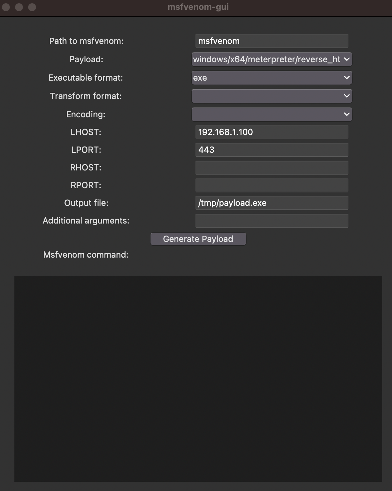

# msfvenomGUI

msfvenomgui provides a graphical UI over Metasploit's msfvenom tool.

This tool was created to satisfy classwork for Dakota State University's CSC-842 Security Tool Development.

Demo video: *coming soon...*



## Prerequisites

- Python 3 Interpreter
- PIP
- msfvenom

## Usage

```bash
# install msfvenomgui with pip
pip install msfvenomgui

# execute msfvenomgui
msfvenomgui
```

## Future Work

1. Expose all payloads and executable formats
2. Automatically find the msvenom path, without blocking the program
3. Dynamically expose arguments based on the selected payload
